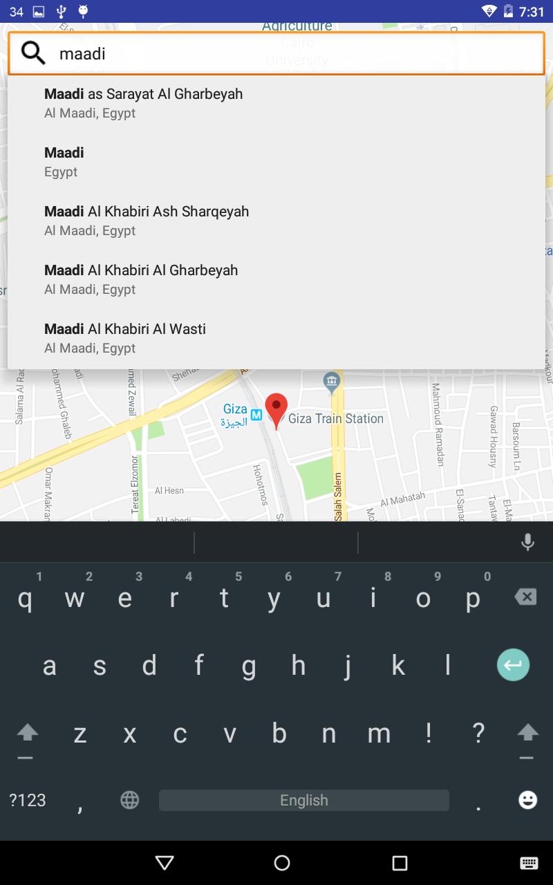

# Simple-Android-Map-App
A simple app to implement google maps device location & Search with place auto complete using MVP as archticture pattern.
 
 

## Screenshots:

 
 

## References:
* [Google Maps SDK](https://developers.google.com/maps/documentation/android-sdk/intro)
* [Google Places SDK](https://developers.google.com/places/android-sdk/intro)
* [PlaceAutoComplete Adapter](https://github.com/googlesamples/android-play-places/blob/master/PlaceCompleteAdapter/Application/src/main/java/com/example/google/playservices/placecomplete/PlaceAutocompleteAdapter.java)
 
 
